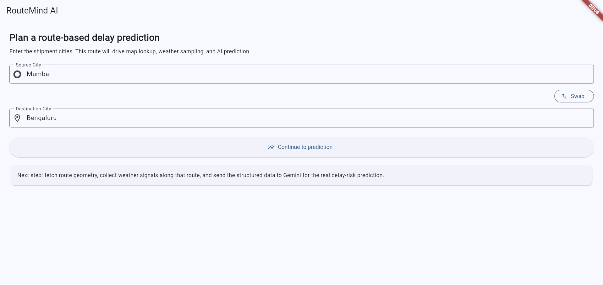
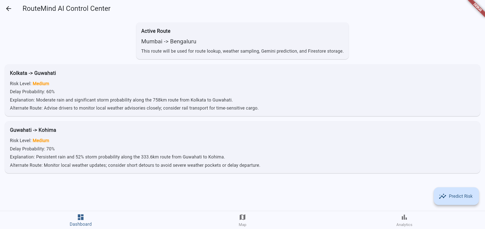
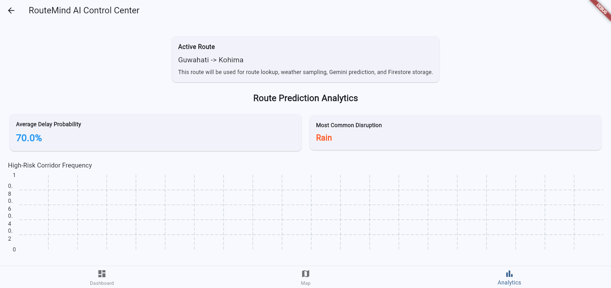
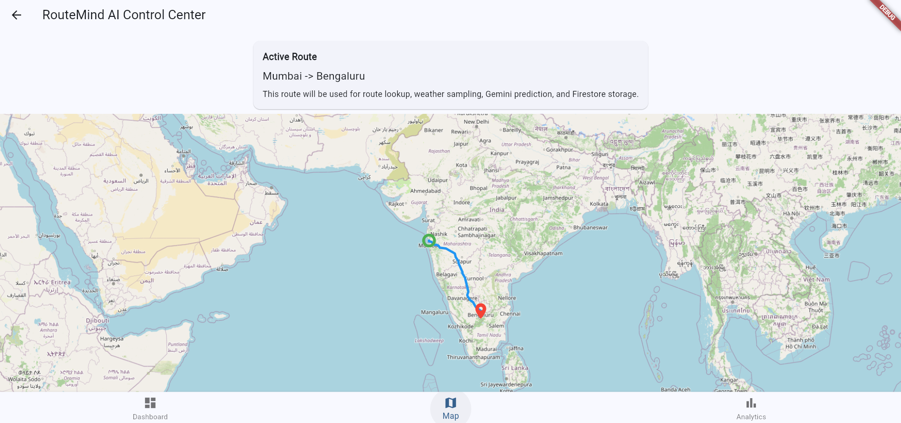

# 🚚 RouteMindAI: Predictive Logistics & Delay Risk Analyzer

> **Built for Hack2Skill Solution Challenge 2026 – Build with AI Track**


 

RouteMindAI is an **AI-powered predictive logistics intelligence platform** that helps fleet managers anticipate delivery delays *before dispatch*, instead of reacting after disruptions occur. By combining **route geometry**, **micro-weather sampling**, and **Google Gemini 2.5 Flash reasoning**, the system generates **interpretable delay-risk predictions** and recommends actionable alternatives.

This project demonstrates how **Generative AI + Geospatial APIs + Weather Intelligence** can transform traditional logistics workflows into **proactive, data-driven planning systems**.

---

## 🌐 Live Project Links

| Resource             | Link                                                                                   |
| -------------------- | -------------------------------------------------------------------------------------- |
| 🚀 Live Web App      | [View Live App](https://routemind-ai-27861.web.app)                                    |
| 🎥 Demo Video        | [Watch on Google Drive](https://drive.google.com/file/d/1MWeILciarlwSSka0yaAojNnoKOIhwD_v/view) |
| 📊 Pitch Deck        | [View Slides](https://docs.google.com/presentation/d/1WfS-QSFF-zwzFoSQJGXZbBhVgyMPjwsI/edit?usp=sharing&ouid=113867034600315517937&rtpof=true&sd=true) |
| 📦 GitHub Repository | [View Source Code](https://github.com/BhaveshV23/RouteMindAI)                          |

---

## 📸 Application Screenshots

### 1️⃣ Route Prediction Input Screen



Users enter shipment source and destination cities.

This triggers:

- route geometry extraction
- weather sampling along the corridor
- Gemini-based delay risk prediction pipeline


---

### 2️⃣ AI Delay Risk Prediction Dashboard



Displays AI-generated logistics insights:

Includes:

- Risk classification (Low / Medium / High)
- Delay probability percentage
- Weather-based explanation
- Suggested alternate routing strategy


---

### 3️⃣ Route Analytics Intelligence Panel



Provides enterprise-style analytics such as:

- Average delay probability
- Most common disruption type
- High-risk corridor frequency tracking

Helps organizations identify long-term disruption hotspots.


---

### 4️⃣ Route Visualization Map



Interactive map view displays:

- shipment origin
- destination
- geographic corridor overview

Supports spatial understanding of predicted risk zones.

---

## 📌 Problem Statement

Modern logistics operations still depend heavily on **reactive planning**.

Fleet operators typically:

* dispatch shipments based on static route estimates
* rely on incomplete weather insights
* detect risks only after vehicles are already in transit
* suffer delays, fuel losses, and supply-chain disruption

This leads to:

❌ missed delivery windows

❌ increased operational costs

❌ poor customer experience

❌ inefficient route planning decisions

---

## 💡 Our Solution

RouteMindAI introduces an **AI-driven predictive route-risk intelligence system** that:

✅ samples weather conditions *along the actual shipment corridor*

✅ evaluates route geometry using geospatial APIs

✅ analyzes structured climate signals using Gemini 2.5 Flash

✅ generates interpretable risk probability scores

✅ recommends safer alternate logistics strategies

Instead of reacting to delays, logistics teams can now **prevent them proactively**.

---

## 🎯 Target Users

RouteMindAI is designed for:

* Fleet managers
* Supply chain analysts
* Logistics startups
* Transport aggregators
* Warehouse dispatch coordinators
* Enterprise logistics planning teams

---

## ✨ Core Features

### 1️⃣ Automated Route Geometry Extraction

The system automatically:

* converts source & destination into coordinates
* generates route polylines
* extracts route nodes
* samples geographic checkpoints along the corridor

Powered by:

**OpenRouteService Directions API**

---

### 2️⃣ Micro-Weather Corridor Sampling

Instead of city-level forecasts, RouteMindAI performs:

📍 node-level weather intelligence collection

Weather parameters sampled include:

* rainfall probability
* cloud coverage
* storm intensity
* humidity conditions

This produces **route-specific climate intelligence**, not generic forecasts.

Powered by:

**OpenWeatherMap API**

---

### 3️⃣ Gemini-Powered Delay Risk Prediction Engine

Structured weather + route data is converted into a JSON payload and analyzed using:

**Google Gemini 2.5 Flash**

Gemini produces:

* delay probability percentage
* risk classification (Low / Medium / High)
* explanation of risk factors
* corridor-level insights
* alternate route suggestions

This transforms raw environmental signals into **actionable logistics intelligence**.

---

### 4️⃣ High-Risk Corridor Intelligence Dashboard

All predictions are stored inside:

**Firebase Firestore**

This enables:

📊 historical analytics

📊 route-risk trend tracking

📊 repeated delay corridor detection

📊 enterprise planning support

Organizations can identify *long-term disruption hotspots*.

---

## 🧠 AI Pipeline Architecture

Below is the intelligence pipeline used inside RouteMindAI:

```
User Input
   ↓
Geocoding (Source → Destination)
   ↓
Polyline Route Extraction
   ↓
Route Node Sampling
   ↓
Weather Sampling at Each Node
   ↓
Structured JSON Risk Payload
   ↓
Gemini 2.5 Flash Analysis
   ↓
Delay Probability + Explanation
   ↓
Firestore Storage
   ↓
Analytics Dashboard Visualization
```

---

## 🏗️ System Architecture Overview

### Frontend

**Flutter Web (Dart)**

Chosen because:

* single codebase supports mobile + web
* fast UI rendering
* scalable architecture

---

### Backend Infrastructure

**Firebase Platform**

Includes:

* Firebase Hosting
* Cloud Firestore
* Secure API integration

Benefits:

* real-time sync
* scalable architecture
* zero-server deployment

---

### AI Engine

**Google Gemini 2.5 Flash**

Used for:

* structured reasoning
* probability estimation
* corridor-risk interpretation
* alternate route suggestions

Gemini acts as a **virtual logistics analyst**.

---

### External APIs Used

| API              | Purpose                     |
| ---------------- | --------------------------- |
| OpenRouteService | Geocoding + Route Polyline  |
| OpenWeatherMap   | Micro-weather intelligence  |
| Gemini API       | Predictive reasoning engine |

---

## 🔄 Data Flow Diagram (Conceptual)

```
User enters route
      ↓
OpenRouteService generates polyline
      ↓
System extracts sample nodes
      ↓
Weather fetched per node
      ↓
Structured JSON generated
      ↓
Gemini analyzes disruption probability
      ↓
Prediction saved in Firestore
      ↓
Dashboard displays insights
```

---

## 📊 Example Output Generated by RouteMindAI

Example prediction:

```
Route: Pune → Mumbai
Risk Level: HIGH
Delay Probability: 68%
Reason:
Heavy rainfall clusters detected near Lonavala corridor
Alternate Suggested:
NH160 corridor route recommended
```

This makes predictions **interpretable and operationally useful**.

---

## 🚀 Local Setup Guide

Follow these steps to run the project locally.

### Step 1 — Clone Repository

```
git clone https://github.com/BhaveshV23/RouteMindAI.git
cd RouteMindAI
```

---

### Step 2 — Install Dependencies

```
flutter pub get
```

---

### Step 3 — Configure Environment Variables

Create a file named:

```
.env
```

Inside project root directory.

Add the following:

```
GEMINI_API_KEY=your_api_key
ORS_API_KEY=your_api_key
OPENWEATHER_API_KEY=your_api_key
```

⚠️ Keys are excluded intentionally for security reasons.

---

### Step 4 — Run Application

Run on Chrome:

```
flutter run --dart-define-from-file=.env -d chrome
```

---

## ☁️ Deployment Architecture

RouteMindAI is deployed using:

**Firebase Hosting**

Deployment steps:

```
flutter build web
firebase deploy
```

---

## 🔐 Security Considerations

RouteMindAI follows best practices:

✅ API keys stored in .env

✅ keys excluded from GitHub

✅ Firebase-managed hosting

✅ structured JSON prompts for safe AI usage

---

## 📈 Future Improvements (Post-Hackathon Roadmap)

Upcoming enhancements planned:

* traffic congestion prediction integration
* historical delay ML training dataset
* fleet-scale batch route evaluation
* live vehicle tracking overlay
* enterprise dashboard analytics
* mobile application release

---

## 👨‍💻 Author

**Bhavesh Vadnere**

Information Technology Engineering Student

GitHub: [https://github.com/BhaveshV23](https://github.com/BhaveshV23)

Linkedin: [https://linkedin.com/in/bhavesh-vadnere](https://linkedin.com/in/bhavesh-vadnere)

---

## ⭐ Support the Project

If you found this useful:

⭐ Star the repository

🍴 Fork the project

📢 Share feedback

🤝 Collaborate on improvements

---

## 📜 License

This project is created for **educational and hackathon demonstration purposes**.

Production adaptation may require:

* enterprise weather APIs
* fleet telemetry integration
* compliance alignment

---

# 🚀 RouteMindAI Vision

"From reactive logistics to predictive intelligence powered by AI."
